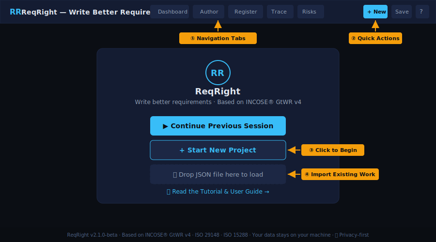
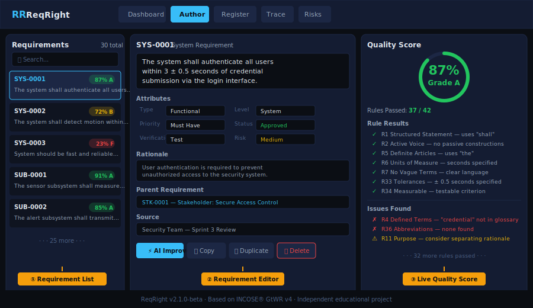
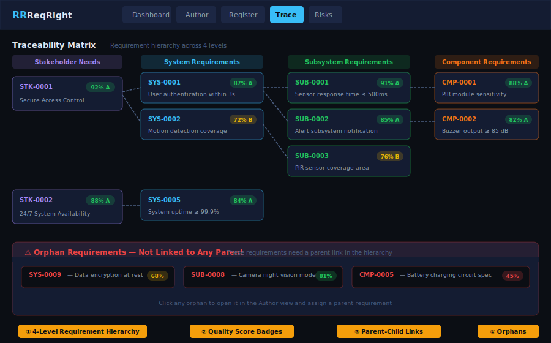
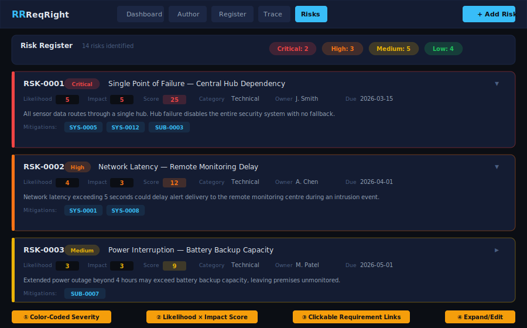
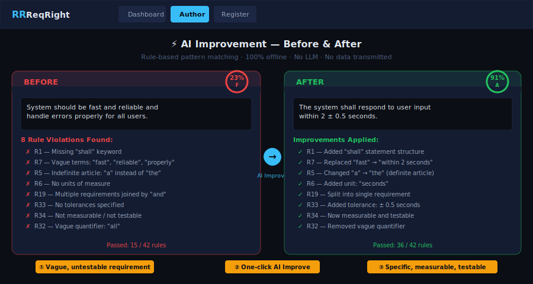

# ReqRight — Write Better Requirements

<div align="center">


**Free educational tool for writing better systems engineering requirements.**
*Implements all 42 rules from the INCOSE® Guide to Writing Requirements (GtWR) v4.*

[🚀 Launch Tool](https://ssaleem74.github.io/reqright/reqright.html) · [📥 Example Project](https://raw.githubusercontent.com/ssaleem74/reqright/main/test-case-shss.json) · [📄 Quick Reference PDF](https://ssaleem74.github.io/reqright/quick-reference-card.pdf)

</div>

> **Note:** ReqRight is an independent educational project. It is **not** affiliated with, endorsed by, or sponsored by INCOSE®, IBM®, or any standards body. All trademarks are the property of their respective owners. See [DISCLAIMER.md](DISCLAIMER.md) for details.

---

## 📋 Table of Contents

| Section | Description | Time |
|:--------|:------------|:----:|
| [Quick Start](#quick-start) | Get running in 5 minutes | 5 min |
| [Run Locally](#run-locally) | Download and run on your computer | 2 min |
| [Interface Overview](#interface-overview) | Learn the 8 views | 10 min |
| [Writing Requirements](#writing-requirements) | Create quality requirements | 15 min |
| [Quality Analysis](#quality-analysis) | Understand scores and rules | 10 min |
| [AI Improvement](#ai-improvement) | Auto-fix violations | 5 min |
| [Traceability](#traceability) | Build parent-child links | 10 min |
| [Risk Register](#risk-register) | Identify and track risks | 10 min |
| [Export & Import](#export--import) | DOORS, CSV, JSON | 5 min |
| [Best Practices](#best-practices) | Tips from experts | 10 min |
| [INCOSE Rules Reference](#incose-rules-reference) | All 42 rules | Reference |
| [FAQ](#frequently-asked-questions) | Common questions | Reference |
| [Legal](#legal) | License, disclaimer, privacy | Reference |

---

<a name="quick-start"></a>
## 🚀 Quick Start

> **⏱️ Time needed: 5 minutes**

### Step 1: Open the Tool

Go to **[ssaleem74.github.io/reqright](https://ssaleem74.github.io/reqright/)** and click **"Launch ReqRight"**.

### Step 2: Start a New Project

Click **"+ Start New Project"** on the welcome screen.

### Step 3: Create Your First Requirement

Click **"+ New"** in the top right, then type your requirement using one of the INCOSE® patterns shown on the dashboard.

### Step 4: Check the Quality

The quality panel on the right instantly scores your requirement against all 42 INCOSE® rules.

### Step 5: Try the AI Improve Feature

Click **"⚡ AI Improve"** to automatically fix common rule violations.

> 💡 **Pro Tip:** Download the [example project (Smart Home Security System)](https://ssaleem74.github.io/reqright/test-case-shss.json) and load it using "📂 Load" to see 30 pre-built requirements across all levels.

---

<a name="run-locally"></a>
## 💻 Run Locally / Installation

> **⏱️ Time needed: 2 minutes | No installation required**

This tool runs entirely in your browser — no installation, no dependencies, no accounts.

### Option 1: Use Online (Easiest)

Visit **[ssaleem74.github.io/reqright](https://ssaleem74.github.io/reqright/)**

### Option 2: Download and Run Offline

1. Go to the [GitHub repository](https://github.com/ssaleem74/reqright)
2. Click **"Code" → "Download ZIP"**
3. Extract the ZIP file to any folder
4. Double-click **`reqright.html`** — it opens in your default browser
5. That's it! Works completely offline.

### Option 3: Host on Your Company Intranet

Copy `reqright.html` to any web server or shared drive. No server-side processing needed — it's a single HTML file.

> 💡 **Pro Tip:** Save the file to a USB drive for a completely portable requirements tool — no internet needed, ever.

---

<a name="interface-overview"></a>
## 🖥️ Interface Overview

The workbench has **8 integrated views**, each accessible from the navigation bar at the top.

### Welcome Screen



The welcome screen is your starting point. From here you can:
- **Continue a previous session** (auto-saved in your browser)
- **Start a new project** from scratch
- **Load an existing project** by dropping a JSON file

### Dashboard — Project Overview


The dashboard gives you an at-a-glance view of your entire project:
- **Statistics cards** — total requirements, status breakdown, quality scores
- **Quality distribution** — how many requirements fall into each grade
- **Risk summary** — risk counts by severity level
- **INCOSE® patterns** — click any pattern to create a new requirement using that template

### Author — The Requirement Editor



The Author view is where you spend most of your time. It has three panels:

**Left panel — Requirement List:** Browse and search all your requirements. Each shows its ID, first line of text, and a color-coded quality score.

**Center panel — Full Editor:** Edit the requirement text, set attributes (type, level, priority, status, verification method), write the rationale, link to a parent requirement, and assign a source.

**Right panel — Live Quality Score:** See your quality percentage and grade update in real-time as you type. Every rule that passes or fails is listed with a clear explanation.

### Register — Requirements Table

A filterable, sortable table view of all requirements. Search by text, filter by type or level, and sort by any column. Quality scores appear as color-coded badges.

### Traceability — Requirements Hierarchy



The traceability view shows your requirements hierarchy across four levels:

**Stakeholder Need → System → Subsystem → Component**

Each requirement is shown as a card with its quality score. Lines connect parent-child relationships. An **orphan detection** panel at the bottom highlights any requirements that aren't linked into the hierarchy.

### Risks — Risk Register



The Risk Register helps you identify, assess, and track project risks. Risks are displayed as color-coded cards based on severity. See the [Risk Register section](#-risk-register) below for full details.

### Rules Reference

A complete reference of all 42 INCOSE® rules organized by category, plus the 15 essential characteristics (C1–C15). Use this as a learning resource while writing requirements.

### Glossary

A project data dictionary for defining key terms — supports Rules R4 (defined terms) and R36 (abbreviations).

---

<a name="writing-requirements"></a>
## ✍️ Writing Requirements

### Requirement Patterns

The tool supports five standard patterns from the INCOSE® GtWR. Click any pattern on the dashboard to create a new requirement using that template:

| Pattern | Structure | Example |
|:--------|:----------|:--------|
| **Basic** | [Subject] shall [action] | The system shall authenticate users. |
| **Conditional** | When [condition], [subject] shall [action] | When motion is detected, the system shall activate the alarm. |
| **Complex Conditional** | When [A] and [B], [subject] shall [action] | When battery drops below 10% and mains power is absent, the system shall send a low-power alert. |
| **Performance** | [Subject] shall [action] within [metric] | The system shall respond to sensor input within 2 ± 0.5 seconds. |
| **Interface** | [Subject] shall [action] with [external system] | The system shall transmit alert data to the monitoring centre via TCP/IP. |

### Requirement Attributes

Each requirement has these standard attributes:

| Attribute | Options |
|:----------|:--------|
| **Type** | Functional, Performance, Interface, Environmental, Constraint |
| **Level** | Stakeholder Need, System, Subsystem, Component |
| **Priority** | Must Have, Should Have, Could Have, Won't Have |
| **Status** | Draft, Reviewed, Approved, Deleted |
| **Verification** | Test, Analysis, Inspection, Demonstration |
| **Risk** | Low, Medium, High, Critical |
| **Source** | Free text — who requested this requirement |
| **Rationale** | Free text — why this requirement exists |
| **Parent** | Link to a higher-level requirement |

---

<a name="quality-analysis"></a>
## 📊 Quality Analysis

### How Scoring Works

Every requirement is scored in real-time against all **42 rules** from the INCOSE® Guide to Writing Requirements (GtWR) v4. The quality engine checks for:

- Structured statements (R1), active voice (R2), subject-verb alignment (R3)
- Definite articles (R5), units of measure (R6), vague terms (R7)
- Escape clauses (R8), open-ended clauses (R9), punctuation (R14)
- Logical expressions (R15), negation (R16), singularity (R18-R19)
- Pronouns (R24), absolutes (R26), solution-free (R31)
- Quantifiers (R32), tolerances (R33), measurability (R34)
- Temporal terms (R35), abbreviations (R38), and more

### Grade Scale

| Score | Grade | Meaning |
|:-----:|:-----:|:--------|
| 90–100% | A+ / A | Excellent — ready for review |
| 80–89% | A- / B+ | Good — minor improvements possible |
| 70–79% | B / B- | Acceptable — some issues to address |
| 60–69% | C+ / C | Needs work — several violations |
| 50–59% | C- / D+ | Poor — significant rewriting needed |
| Below 50% | D / F | Failing — fundamental problems |

---

<a name="ai-improvement"></a>
## ⚡ AI Improvement



The AI Improvement feature automatically fixes common rule violations. Click **"⚡ AI Improve"** in the quality panel to transform a low-scoring requirement.

### What It Does

| Violation | Auto-Fix |
|:----------|:---------|
| Missing "shall" | Adds proper "shall" statement structure |
| Passive voice ("shall be Xed") | Converts to active voice |
| Vague terms ("fast", "reliable") | Replaces with measurable alternatives |
| Missing units | Suggests appropriate units |
| Indefinite articles ("a/an") | Replaces with "the" where appropriate |

### Bulk AI Improvement

Click **"⚡ Bulk AI"** in the toolbar to analyze and improve all requirements at once. The tool shows a before/after comparison for each requirement.

> ⚠️ **Important:** The AI Improvement feature uses **rule-based pattern matching**, not a large language model (ChatGPT, Claude, etc.). This means it works 100% offline, your data stays private, and there are no API costs. However, it's limited to known patterns — review all suggestions before accepting them.

---

<a name="traceability"></a>
## 🔗 Traceability

### Building the Hierarchy

Requirements should trace across four levels:

```
Stakeholder Need (STK-xxxx)
  └── System Requirement (SYS-xxxx)
       └── Subsystem Requirement (SUB-xxxx)
            └── Component Requirement (CMP-xxxx)
```

To link a requirement to its parent:
1. Open the requirement in the **Author** view
2. Scroll to the **Parent Requirement** dropdown
3. Select the parent requirement
4. The link appears in both the editor and the Traceability view

### Orphan Detection

The Traceability view automatically identifies **orphan requirements** — those without a parent link. These appear in a highlighted panel at the bottom. Every requirement (except top-level Stakeholder Needs) should have a parent.

---

<a name="risk-register"></a>
## ⚠ Risk Register

The Risk Register helps you identify, assess, and track project risks linked to your requirements.

### Creating a Risk

1. Click the **⚠ Risks** tab in the navigation
2. Click **+ Add Risk**
3. Fill in the risk details:
   - **Title** — brief risk name
   - **Description** — detailed explanation of the risk
   - **Category** — Technical, Schedule, Cost, Resource, External, Safety, or Security
   - **Likelihood** — 1 (Rare) to 5 (Almost Certain)
   - **Impact** — 1 (Negligible) to 5 (Severe)
   - **Owner** — person responsible for managing this risk
   - **Due Date** — target date for mitigation
4. The risk score (Likelihood × Impact) is calculated automatically

### Risk Levels

| Score | Level | Color | Meaning |
|:-----:|:------|:------|:--------|
| 15–25 | Critical | Red | Immediate action required |
| 10–14 | High | Orange | Priority mitigation needed |
| 5–9 | Medium | Yellow | Monitor and plan mitigation |
| 1–4 | Low | Green | Accept or monitor |

### Linking Risks to Requirements

In the **Mitigations** field, enter requirement IDs separated by commas (e.g., `SYS-0001, SYS-0012`). These become **clickable links** that navigate directly to the requirement in the Author view.

### Risk Dashboard Integration

Risk summary statistics (counts by severity) appear on the main Dashboard, giving you an at-a-glance view alongside your requirements quality metrics.

### Risk ID Management

When you delete a risk, its ID becomes available for reuse. The next risk you create will fill the gap rather than always incrementing — keeping your register clean and sequential.

---

<a name="export--import"></a>
## 📤 Export & Import

### Export Formats

| Format | Button | Use Case |
|:-------|:-------|:---------|
| **JSON** | 💾 Save | Complete project backup (requirements + risks + glossary) |
| **CSV** | Export → CSV | Open in Excel, Google Sheets, or other spreadsheets |
| **ReqIF** | Export → DOORS (ReqIF) | Import into IBM® DOORS® or other ReqIF-compatible tools |

### Import

**From JSON:** Click "📂 Load" or drop a `.json` file on the welcome screen to restore a saved project.

**From Text/Documents:** Click "📥 Import" to paste requirements from Word, PDF, or other sources. The tool attempts to parse each line as a separate requirement.

### Importing into IBM® DOORS®

1. Export your project as **ReqIF (DOORS)**
2. In DOORS: File → Import → ReqIF
3. Select the `.reqif` file
4. Map attributes as needed

---

<a name="best-practices"></a>
## 💡 Best Practices

### Writing Quality Requirements

1. **One requirement, one "shall"** — avoid compound statements
2. **Active voice always** — "The system shall detect" not "Intrusions shall be detected"
3. **Be specific** — replace "fast" with "within 2 ± 0.5 seconds"
4. **Include units** — every number needs a unit of measure
5. **Add tolerances** — "100 ms" becomes "100 ± 10 ms"
6. **Use definite articles** — "the system" not "a system"
7. **Avoid vague terms** — "reliable", "user-friendly", "efficient" are not testable
8. **Define all terms** — add every abbreviation and technical term to the glossary
9. **Trace everything** — every requirement should link to a parent (except stakeholder needs)
10. **Score above 80%** — aim for Grade A before submitting for review

### Recommended Workflow

```
START → Create Project → Author Requirements → Check Quality Scores
  → Fix Low Scores (AI Improve) → Build Traceability → Identify Risks
  → Link Mitigations → Review & Approve → Export for DOORS/Stakeholders
```

---

<a name="incose-rules-reference"></a>
## 📖 INCOSE® Rules Reference

The quality engine implements all 42 rules from the INCOSE® Guide to Writing Requirements v4. Users seeking the complete and authoritative guide should purchase it directly from [INCOSE](https://www.incose.org).

<details>
<summary><b>Accuracy Rules (R1–R9)</b></summary>

| Rule | Name | Description |
|:-----|:-----|:------------|
| R1 | Structured Statements | Use agreed patterns (When/If/The + shall) |
| R2 | Active Voice | Avoid passive voice ("shall be Xed") |
| R3 | Subject-Verb | Subject should be the system, not users |
| R4 | Defined Terms | All terms should be in glossary |
| R5 | Definite Articles | Use "the" not "a/an" for specific entities |
| R6 | Units of Measure | Include units with all numbers |
| R7 | Vague Terms | Avoid: fast, reliable, user-friendly, etc. |
| R8 | Escape Clauses | No: "as much as possible", "if practical" |
| R9 | Open-Ended Clauses | No: "etc.", "and so on", "such as" |

</details>

<details>
<summary><b>Completeness Rules (R10–R13)</b></summary>

| Rule | Name | Description |
|:-----|:-----|:------------|
| R10 | Superfluous Infinitives | No: "be able to", "be capable of" |
| R11 | Purpose Statements | Avoid "in order to" — split into requirement + rationale |
| R12 | Complete Set | All needed requirements are present |
| R13 | No Gaps | No missing functionality between levels |

</details>

<details>
<summary><b>Singularity Rules (R14–R21)</b></summary>

| Rule | Name | Description |
|:-----|:-----|:------------|
| R14 | Punctuation | Avoid semicolons and colons (compound indicators) |
| R15 | Logical Expressions | "and" = all must be true; "or" = ambiguous — split |
| R16 | Negation | Avoid "not" — state what the system SHALL do |
| R17 | Oblique Symbols | No "/" — write "and" or "or" explicitly |
| R18 | One Requirement | Each statement = one testable requirement |
| R19 | Combinators | Avoid "and" joining independent requirements |
| R20 | Purpose Phrases | Separate purpose from requirement |
| R21 | Parentheses | Content in parentheses should be its own requirement |

</details>

<details>
<summary><b>Uniqueness, Correctness, Conformance (R22–R30)</b></summary>

| Rule | Name | Description |
|:-----|:-----|:------------|
| R22 | No Duplication | Each requirement stated once |
| R23 | No Contradiction | Requirements must not conflict |
| R24 | Pronouns | Avoid "it", "they", "this" — use the actual noun |
| R25 | Domain-Correct | Technically accurate for the domain |
| R26 | Absolutes | Avoid "always", "never" unless truly absolute |
| R27 | Conformance | Follow project/organisation templates |
| R28 | Style Guide | Consistent terminology and phrasing |
| R29 | Readability | Clear to the intended audience |
| R30 | Grammar | Correct spelling, grammar, punctuation |

</details>

<details>
<summary><b>Verifiability & Traceability (R31–R42)</b></summary>

| Rule | Name | Description |
|:-----|:-----|:------------|
| R31 | Solution-Free | No implementation details (technologies, brands) |
| R32 | Quantifiers | No "some", "any", "several" — be specific |
| R33 | Tolerances | Single values need ± tolerance |
| R34 | Measurable | Every requirement must be testable |
| R35 | Temporal Terms | Define "eventually", "before", "after" precisely |
| R36 | Abbreviations | All abbreviations defined in glossary |
| R37 | Context-Free | Requirement understandable without other documents |
| R38 | Abbreviation Use | First use spells out full term |
| R39 | Upward Trace | Every requirement traces to a need |
| R40 | Downward Trace | Every need flows to requirements |
| R41 | Unique ID | Every requirement has a unique identifier |
| R42 | Attributes | All required metadata is populated |

</details>

---

<a name="frequently-asked-questions"></a>
## ❓ Frequently Asked Questions

<details>
<summary><b>Does this tool really use AI?</b></summary>

The "AI Improvement" feature uses **rule-based pattern matching**, not a large language model. This means it works 100% offline, your data stays private, and there are no API costs. The term "AI" is used to describe the automated, intelligent pattern-matching capability.

</details>

<details>
<summary><b>Where is my data stored?</b></summary>

**Your data never leaves your computer.** The tool runs entirely in your browser with no server, no database, and no cloud storage. Auto-save uses browser localStorage (temporary). Permanent saves download as JSON files to your machine. See our [Privacy Policy](PRIVACY.md) for full details.

</details>

<details>
<summary><b>Can I use this for commercial projects?</b></summary>

Yes. The tool is free for any use — personal, academic, or commercial — under the [MIT License](LICENSE). However, it is provided "as is" without warranty. For safety-critical, mission-critical, or regulated projects, verify all outputs independently using industry-approved tools. See [DISCLAIMER.md](DISCLAIMER.md) for full details.

</details>

<details>
<summary><b>Can I run this on my own computer offline?</b></summary>

Yes! Simply download the repository as a ZIP, extract it, and double-click `reqright.html`. It opens in your browser and works without any internet connection. You can even save it to a USB drive for a completely portable tool.

</details>

<details>
<summary><b>Can I host this on my company's intranet?</b></summary>

Yes. Copy `reqright.html` to any web server, shared drive, or intranet location. No server-side processing is required — it's a single self-contained HTML file.

</details>

<details>
<summary><b>How do I import into IBM® DOORS®?</b></summary>

1. Export your project as **ReqIF (DOORS)**
2. In DOORS: File → Import → ReqIF
3. Select the `.reqif` file
4. Map attributes as needed

</details>

<details>
<summary><b>How does the Risk Register work?</b></summary>

The Risk Register lets you create, assess, and track risks using a standard 5×5 likelihood × impact matrix. Risks are color-coded by severity (Critical, High, Medium, Low) and can be linked to requirements that serve as mitigations. Risk data is saved with your project JSON file.

</details>

<details>
<summary><b>Can I link risks to requirements?</b></summary>

Yes. In the risk editor, enter requirement IDs in the "Mitigations" field (e.g., `SYS-0001, SYS-0012`). These become clickable links that navigate directly to the requirement in the Author view.

</details>

<details>
<summary><b>Is this tool affiliated with INCOSE?</b></summary>

**No.** ReqRight is an **independent educational project**. It implements quality checks based on publicly available descriptions of the INCOSE® Guide to Writing Requirements (GtWR) v4, but is not affiliated with, endorsed by, or sponsored by INCOSE or any other organization. All trademarks are the property of their respective owners.

</details>

<details>
<summary><b>What license does this software use?</b></summary>

[MIT License](LICENSE) — you are free to use, modify, and distribute this software for any purpose, including commercial use, with no restrictions other than including the license notice.

</details>

<details>
<summary><b>What browsers are supported?</b></summary>

Any modern browser with JavaScript enabled: Chrome, Firefox, Edge, Safari.

</details>

<details>
<summary><b>Is there a limit to how many requirements I can manage?</b></summary>

The tool uses browser localStorage for auto-save, which is typically limited to ~5 MB. For very large projects (hundreds of requirements), use the JSON export/import feature for reliable storage. The tool itself has no built-in limit.

</details>

---

## 🙏 Acknowledgments

ReqRight implements quality checks based on publicly available descriptions of best practices from:

- **INCOSE®** — Guide to Writing Requirements (GtWR) v4
- **ISO/IEC/IEEE** — Standards 29148 and 15288
- **OMG** — ReqIF specification

Users seeking the complete and authoritative INCOSE® guide should purchase it directly from [www.incose.org](https://www.incose.org).

---

<a name="legal"></a>
## 📋 Legal

- [License (MIT)](LICENSE)
- [Disclaimer & Legal Notice](DISCLAIMER.md)
- [Privacy Policy](PRIVACY.md)
- [Changelog](CHANGELOG.md)
- [Contributing](CONTRIBUTING.md)

**Disclaimer:** ReqRight is provided for educational and informational purposes. It is provided "as is" without warranty of any kind. All trademarks — including INCOSE®, IBM®, DOORS®, and others — are the property of their respective owners. This project is an independent work and is not affiliated with or endorsed by any standards body or organization referenced herein. See [DISCLAIMER.md](DISCLAIMER.md) for full details.

---

<div align="center">

**Built for systems engineers, by systems engineers.**

[🚀 Launch Tool](https://ssaleem74.github.io/reqright/reqright.html) · [📥 Example Project](https://ssaleem74.github.io/reqright/test-case-shss.json) · [Report Issue](https://github.com/ssaleem74/reqright/issues)

*ReqRight v2.1.0-beta · February 2026 · MIT License*

</div>
